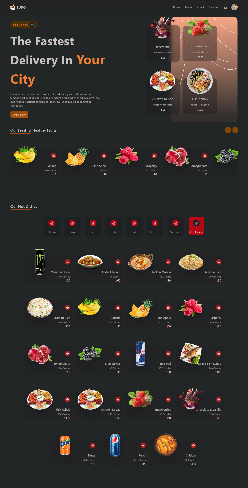
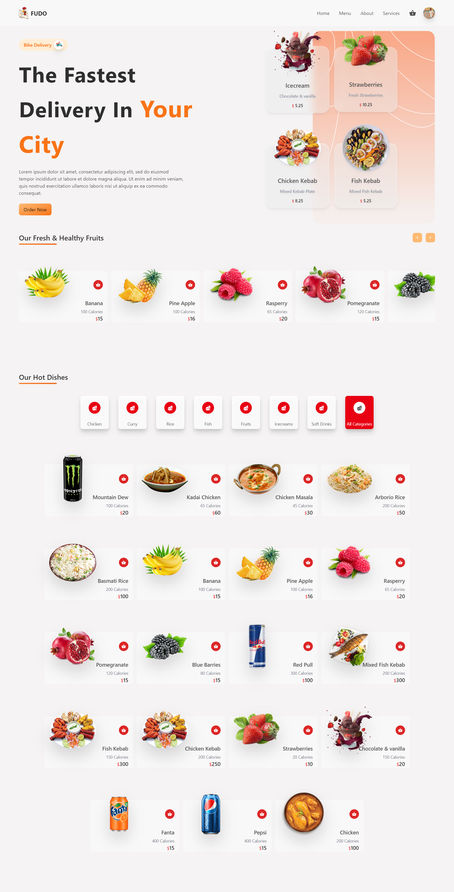
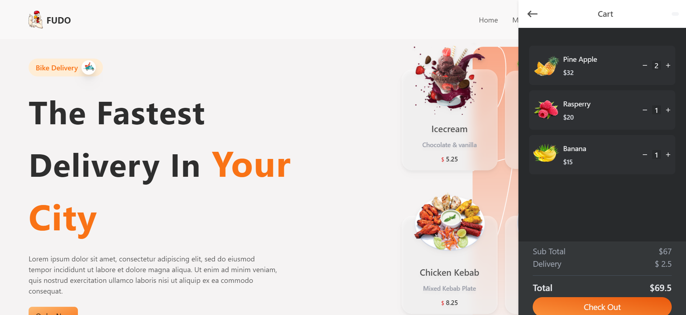
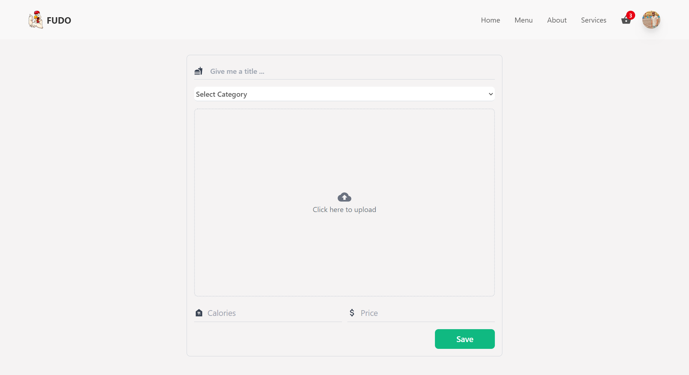

<h1 style="color:#facd8a ">Food Delivery </h1>

## Full Stack Food Delivery React Application   

 This projects allows to the user to add new items and to maintain all the things over the firestore cloud database

<h1 style="color:#facd8a "> Front-end Technologies and liberaries </h1>

    - HTML
    - CSS
    - JavaScript
    - React.js
    - Redux
    - Google Authentication
    - Tailwind CSS
    - FireBase 
    - Framer motion
    - React Icons
    - MUI

<h1 style="color:#facd8a "> User Stories & Features</h1>

    - User can see Meals and Fruits 
    - User can add meals to cart 
    - Then user must be signed in to make order
    - User must signup with google authentication 
    - Admin User can add meals from admin page
    - All meals stored in firebse storage
    - User can see the orders in cart 
    - Meals in cart stored in local storage
    - Advanced React Best Practices, such as folder & file structure, hooks, and refs
    - Creating a User Interface using Tailwind css
    - Working with Google Firebase
    - Framer motion animations without affecting loading speed
    - Responsive Material UI designs

  <h3 style="color:#facd8a ">Website Screenshot in Laptop screen </h3>
    <h4 style="color:#facd8a ">Home Page </h4>
      
     
    
    <h4 style="color:#facd8a ">Admin Page </h4>
    
    
    

<h1 style="color:#facd8a "> Check out Website Preview Here </h1>

> [food-delivery.com](https://food-delivery-ashy.vercel.app/)

<h1 style="color:#facd8a "> Check out Website Video Here </h1>

> [Youtube video](https://youtu.be/WTzLFDL2F_A)

## Available Scripts

In the project directory, you can run:

### `npm start`

